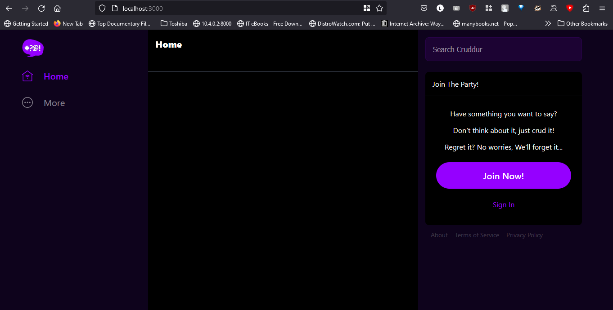
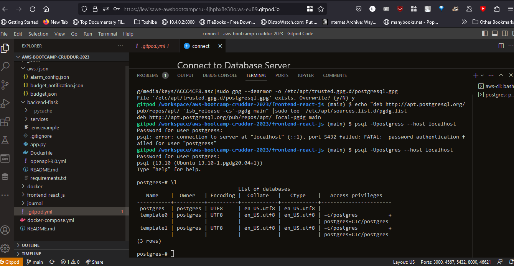
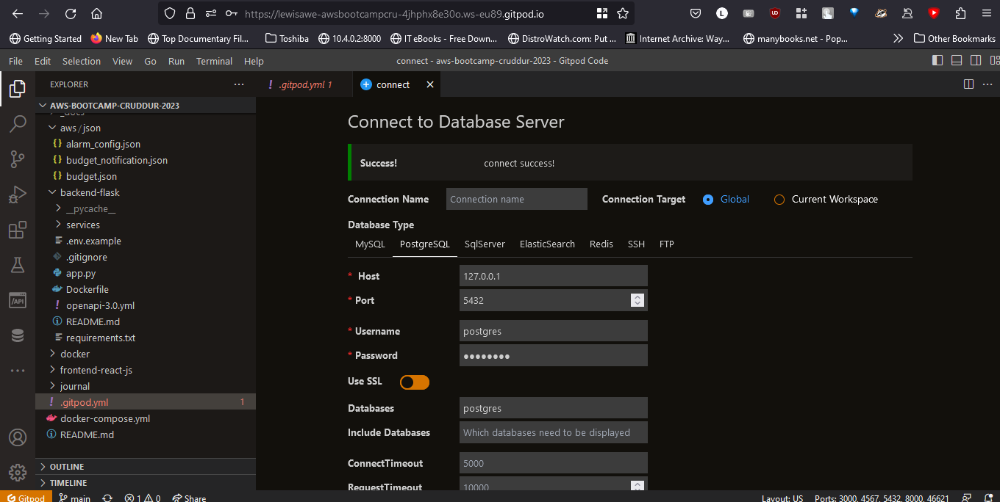
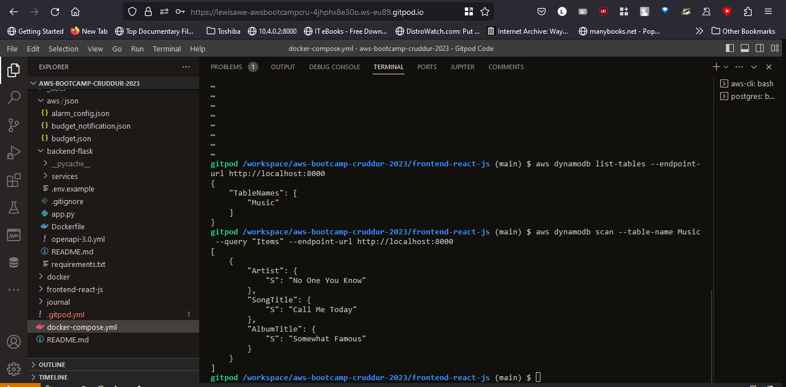
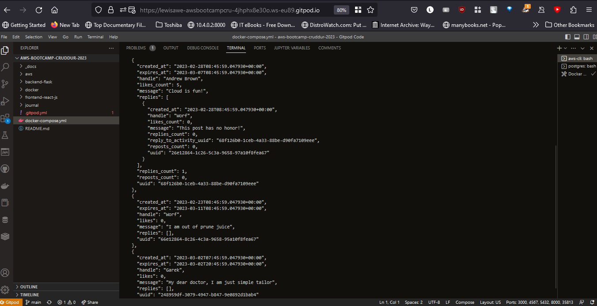
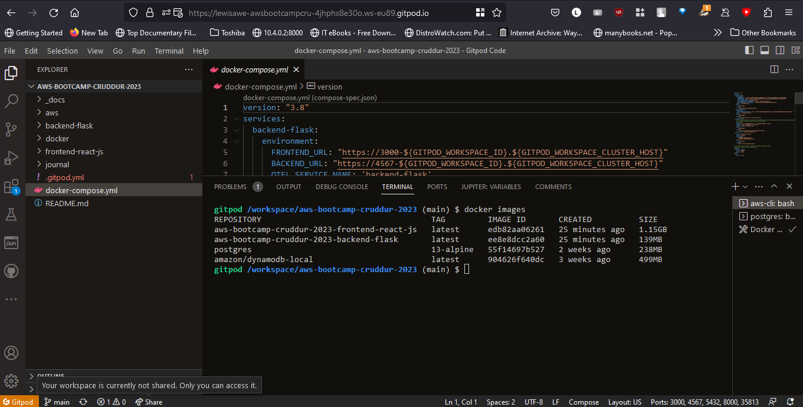
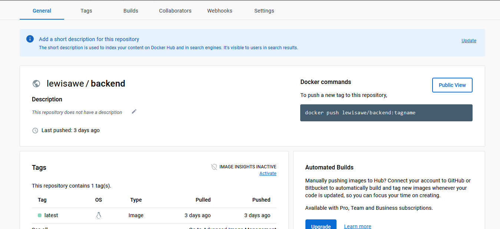
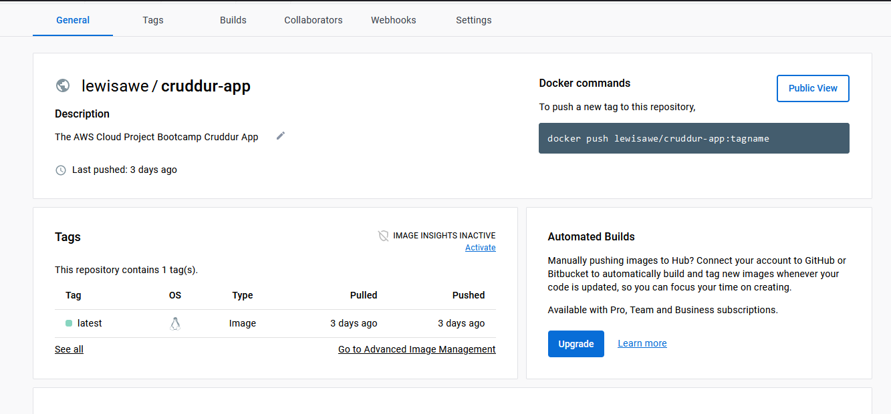

# Week 1 — App Containerization

## Docker Containerization

###











back-end docker hub images 
https://hub.docker.com/repository/docker/lewisawe/backend/general

front-end docker hub images 
https://hub.docker.com/repository/docker/lewisawe/cruddur-app/general

## DockerHUb

```
docker pull lewisawe/cruddur-app:latest
docker pull lewisawe/backend:latest
docker run -p 3000:3000 lewisawe/cruddur-app:latest
docker run -p 4567:4567 lewisawe/backend:latest
```
